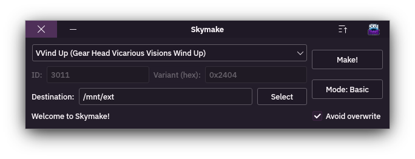

# **Skymake - A simple Skylanders® figurine generator**

## Installation:

### Windows:
#### !! TODO

### Linux:
- From the releases section, download "skymake-linux-glibc-[version].zip"
- Extract the binary into any folder
- Copy the extracted binary file to **/usr/bin** or **/usr/local/bin** or **~/.local/bin** (if you have it in your $PATH)

## ✅ What works:
- Creating Skylanders up to Superchargers
- Creating Magic Items
- Creating Vehicles
- Creating Traps
- Creating Debug Skylanders
- Creating Instant/Virtual Skylander variants
- Creating ***some*** scrapped Skylanders

## ⛔ What it can't:
- Create figures for Imaginators

## Compiling:

### !! TODO