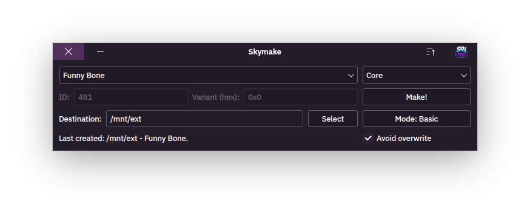

  

# **Skymake - A simple Skylanders® figure generator**

  

## Installation:

### Windows:
-   Follow the compilation steps at the bottom of the page.

###### * If you want to start it like any ordinary desktop app... you're out of luck, unfortunately. (you will have to start skymake from MSYS2). If you know how to compile Qt applications on windows and to make them installable, feel free to contribute.

### Linux:
- Check if you have the right dependencies installed,
- From the releases section, download "skymake-linux-glibc-[version].zip",
- Extract the binary into any folder,
- Copy the extracted binary file to **/usr/bin** or **/usr/local/bin** or **~/.local/bin** (for a local installation; if you have it in your $PATH).

*--OPTIONAL--*

- Copy **skymake.desktop** to **/usr/share/applications**.
    + if you are going with a local installation, you can copy it to **~/.local/share/applications**.
- Copy **skymake.svg** to **/usr/share/icons/hicolor/scalable/apps/**.
    + if you are going with a local installation, you can copy it to **~/.local/share/icons/hicolor/scalable/apps**.

## ✅ What it can:
- Create Skylanders all the way up to Imaginators,
- Create Creation Crystals,
- Create Magic Items,
- Create Vehicles,
- Create Traps,
- Create Debug Skylanders,
- Create Instant/Virtual Skylander variants,
- Create ***some**** scrapped Skylanders.

###### (*It cannot yet create scrapped imaginators figures... the reason can be figured out from the two things skymake can't do. (TL;DR: no Heartbreaker Buckshot :( ))

## ⛔ What it can't:
- Create figures for Imaginators with unique NUIDs.
- Create figures for Imaginators with custom IDs and VarIDs.

## Compiling:

### On Linux:
-   Clone the repository using `git clone https://github.com/rosey-complex/Skymake`
-   Install development files for Qt6Core and Qt6Widgets.
-   In the root directory of the reposotory, run `cmake .` .
-   After cmake finishes, run `make`.
-   If the compilation finishes, you should now have a compiled `skymake` binary.

### On Windows (MSYS2):
-   Install MSYS2.
-   Start MSYS2 MINGW64 from the start menu.
-   In the MSYS2 command line, install the required tools and libaries.
    + Run `pacman -S mingw-w64-x86_64-binutils pactoys git`.
    + Afterwards, run `pacboy -S toolchain:p cmake:p qt6-base:p extra-cmake-modules:p ninja:p`.
    + If prompted to select an option, just press "enter".
-   Clone the repository using `git clone https://github.com/rosey-complex/Skymake`
-   Enter the repository's directory.
-   Run `cmake .` and then, after cmake completes succesfully, run `cmake --build .`.
-   If there are no compilation errors, you should have a compiled `skymake.exe` executable.